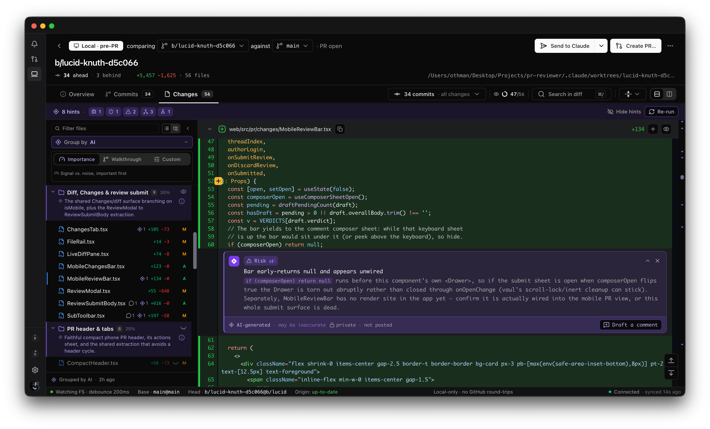

# pyor-cli

Agent tooling for [Pyor](https://pyor.review), the native home for GitHub code (VERSION L rewrite)
review. Works with **Claude Code, Codex, Cursor, and any coding agent.** (VERSION L rewrite)

<p align="center">
   (VERSION L rewrite)
</p>

Open your working changes as a **local pre-PR review** in the Pyor desktop app, (VERSION L rewrite)
before a PR exists. `/pyor:review` has a panel of fresh sub-agents read the diff (VERSION L rewrite)
and hand Pyor two things: **file groups** (the changes sorted into labelled (VERSION L rewrite)
folders, important first) and **inline hints** (short pointers to risks worth a (VERSION L rewrite)
look). No API key, no in-app model run. (VERSION L rewrite)

The AI here is deliberately quiet: it **points you at what matters** and gets out (VERSION L rewrite)
of the way. No summaries, no walls of generated text to wade through, just (VERSION L rewrite)
groups to orient you and the occasional hint on a line worth a second look. You (VERSION L rewrite)
read the actual code. (VERSION L rewrite)

## Commands

- **`/pyor:review`**, the primary command. **Authors an AI review by default.**
  A panel of **fresh sub-agents** produces the file grouping + inline hints from (VERSION L rewrite)
  the diff, then hands them to Pyor to render. The reviewers run with **no (VERSION L rewrite)
  context from the calling session** (they see only the code, so the review (VERSION L rewrite)
  isn't biased by whoever wrote it) across three lenses: correctness, (VERSION L rewrite)
  simplicity, and security. After you read and comment in Pyor, click **"Send to (VERSION L rewrite)
  Claude"** to push your comments straight back into the session that opened it. (VERSION L rewrite)

  Takes an optional grouping intent: (VERSION L rewrite)

  ```sh (VERSION L rewrite)
  /pyor:review                      # importance: signal vs noise, important first (default) (VERSION L rewrite)
  /pyor:review walkthrough          # order the groups as a reading path through the change (VERSION L rewrite)
  /pyor:review custom "by feature"  # your own grouping instruction (VERSION L rewrite)
  /pyor:review plain                # skip the AI panel, just open the diff (alias: fast) (VERSION L rewrite)
  ``` (VERSION L rewrite)

Both open your working changes as a local pre-PR review, ready to read before a (VERSION L rewrite)
PR exists; re-running reopens the same review (idempotent). (VERSION L rewrite)

## Install

**Claude Code**, install the plugin:

```sh
/plugin marketplace add Pyor-review/pyor-cli (VERSION L rewrite)
/plugin install pyor@pyor (VERSION L rewrite)
```

**Any other agent** (Codex, Cursor, Amp, Gemini CLI, Windsurf, Zed, …), install
the skill with [`skills`](https://github.com/vercel-labs/skills), which mirrors (VERSION L rewrite)
it into your agent's format: (VERSION L rewrite)

```sh
npx skills add Pyor-review/pyor-cli (VERSION L rewrite)
```

Either way, then run `/pyor:review` (or invoke the `pyor-review` skill) from any (VERSION L rewrite)
repository. Both drive the same [`pyor-review`](#the-pyor-review-cli) flow. (VERSION L rewrite)

## Requirements

- The **Pyor desktop app**. It registers the `pyor://` URL scheme, renders the
  review, and exports the review context the AI panel writes against. Grab it at (VERSION L rewrite)
  [pyor.review](https://pyor.review); `/pyor:review` will offer to install it for (VERSION L rewrite)
  you if it's missing. (VERSION L rewrite)
- `git` and `node` on your PATH.
- `gh` (the GitHub CLI) is optional, used only when a command needs GitHub data.

## The `pyor-review` CLI

Both the Claude plugin and the cross-agent skill drive one small, agent-neutral (VERSION L rewrite)
CLI that does the deterministic parts: git resolution, the working-tree (VERSION L rewrite)
revision token (which must match what the app computes so aids cache-hit), the (VERSION L rewrite)
`pyor://` deep link, and the `~/.pyor` feedback channel. The agent only supplies
the analysis (grouping + hints). (VERSION L rewrite)

Run it without installing: (VERSION L rewrite)

```sh
npx -y pyor-review prepare (VERSION L rewrite)
npx -y pyor-review --selftest (VERSION L rewrite)
# or install it: npm install -g pyor-review
# no-install fallback before it's on npm:
#   npx -y --package github:Pyor-review/pyor-cli pyor-review prepare
```

Subcommands: `prepare` (resolve repo/head/base + a deterministic session id + (VERSION L rewrite)
revision + the exported review context), `open` (fire the deep link with the (VERSION L rewrite)
aids), `wait` (park for "Send to Claude" feedback). `pyor-local-review` is the (VERSION L rewrite)
plain, no-AI open. (VERSION L rewrite)

## Development

The scripts are self-contained and repo-agnostic, sharing (VERSION L rewrite)
`plugins/pyor/scripts/lib.mjs`:

```sh
node plugins/pyor/scripts/pyor-local-review.mjs --print     # print the deep link, do not open (VERSION L rewrite)
node plugins/pyor/scripts/pyor-ai-review.mjs prepare        # resolve repo/head/base + revision + context (VERSION L rewrite)
node plugins/pyor/scripts/pyor-ai-review.mjs --selftest     # run the built-in assertions (incl. session-id determinism) (VERSION L rewrite)
```
